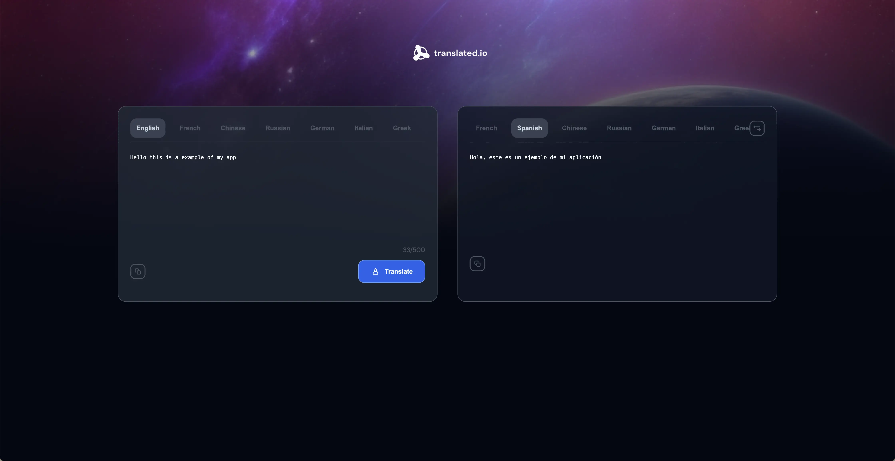

# Translate App

;

This app is made it to replicate the functinality of the Google Translate, but with a beatiful design. You can choose whay language do you want to write and translate, also you can copy to clipboard both text.

## Special Thanks to: <a href="https://devchallenges.io/" target="_blank" rel="noopener noreferrer">Dev Challenges</a>
This site gave us a lot of projects to practice and improve our Dev skills. I choose the translate app because i though this project was defiant to me. But making step by step we can create and solve many problems easily <3. 

### Some techs that is use:

- Typescript
- React
- CSS Modules
- Valibot
- FetchAPI
- React Toastify
- Vite

## Live Project:
🔗 //Todo: add url